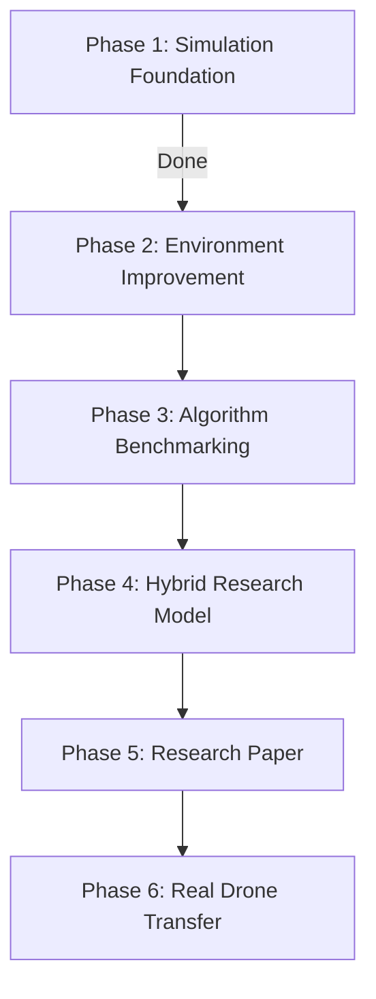

# 🚁 Team Roadmap: Decentralized Multi-UAV Surveillance

Welcome to the **STIRS-2025 Multi-UAV Surveillance Swarm** project roadmap! This document outlines our project vision, architectural evolution, and the upcoming implementation phases for team members.

---

## 💡 Project Concept & Vision

We are building a decentralized, high-fidelity **Software-in-the-Loop (SITL)** simulation where a swarm of autonomous quadcopters coordinates to navigate a procedurally generated urban canyon to search for and track dynamic ground targets (crowds). 

### The Core Problem
In real-world surveillance (e.g., search and rescue, city monitoring), drones must operate without a central controller, with limited battery life, under windy conditions, and with noisy sensors. We model this as a **Partially Observable Markov Decision Process (POMDP)**, where each drone builds its own imperfect belief state using localized sensors.

### Why Pygame → Drone3D (PyBullet)?
Previously, the project used a 2D Pygame interface. We transitioned to **Drone3D (powered by PyBullet)** for several critical reasons:
*   **Physical Realism:** 3D rigid-body aerodynamics, true mass, inertia, and torque-based flight control instead of simple 2D coordinate shifts.
*   **Sensor Modeling:** High-fidelity 3D raycasting (simulating LiDAR) to build localized occupancy grids, incorporating realistic SLAM noise, sensor drift, and signal degradation.
*   **Surveillance Accuracy:** Downward camera Field of View (FOV) cones where coverage area is a direct function of altitude ($Z$-coordinate).
*   **Environment Fidelity:** Multi-level obstacles (buildings) that require altitude adjustments and collision avoidance in three dimensions.
*   **Real Drone Readiness:** A 3D physics-based simulation matches the physical world, making it possible to transfer our trained models to physical autopilot stacks.

### 🎯 The End Goal
Our ultimate objective is a seamless **Sim-to-Real Transfer**. We will develop, train, and validate decentralized control algorithms in this high-fidelity simulation, then transfer the software stack to physical quadcopter autopilots using standard industry middleware (**ArduPilot, PX4, ROS2, and QGroundControl**).

---

## 🗺️ Project Phases

### Phase 1 — Stable Simulation Foundation ✅ *(Completed)*
*   Established the 3D physics-enabled PyBullet environment.
*   Spawns multiple autonomous UAVs with physics, torque-based flight control, wind, and battery limits.
*   Generates procedural building layouts and spawns walking crowds (`RandomCrowd`).
*   Implemented localized 3D raycasting, SLAM noise models (Gaussian, random flips, offset drift), and floating holographic HUDs.
*   Containerized the workspace using Docker and Docker Compose for instant, cross-platform deployment.

### Phase 2 — Environment Improvement ⚙️ *(In Progress)*
Enhancing environment complexity to simulate more realistic city dynamics:
*   **Better City Layout:** Procedural generator featuring realistic street blocks, intersections, and variable building densities.
*   **Dynamic Crowd Movement:** Walkers utilizing pathfinding models (e.g., social force model) to navigate sidewalks rather than simple random walking.
*   **Better Obstacle Generation:** Dynamic obstacles (other flying objects, power lines, trees).
*   **Weather & Wind:** Realistic aerodynamic turbulence, variable wind gusts, and weather placeholders.
*   **Communication Logging:** Decentralized UAV logging to track network packets, bandwidth usage, and transmission loss.

### Phase 3 — Algorithm Benchmarking 📊
Implement and compare standard control and learning algorithms to establish baselines:
*   **Path Planning Algorithms:**
    *   *Classical:* A*, Dijkstra, Rapidly-exploring Random Tree (RRT)
    *   *Heuristic/Meta-heuristic:* Particle Swarm Optimization (PSO)
    *   *Deep RL:* Proximal Policy Optimization (PPO), Deep Q-Networks (DQN)
*   **Collision Avoidance Models:**
    *   Artificial Potential Fields (APF)
    *   Velocity Obstacle (VO)
    *   Reciprocal Velocity Obstacle (RVO)
*   **Evaluation Metrics:**
    *   *Travel Time:* Time taken to complete the search/surveillance pattern.
    *   *Path Length:* Total flight distance of the swarm.
    *   *Collisions:* Count of UAV-to-UAV and UAV-to-building collisions.
    *   *Coverage:* Swarm's search coverage rate over the target area.
    *   *Tracking Success:* Duration ground targets are successfully kept in camera FOV.
    *   *Energy Estimate:* Total battery consumption integrated over flight time.
*   **Expected Output:** Automated scripts that run test episodes and output comprehensive comparison tables and graphs.

### Phase 4 — Hybrid Model (Research Contribution) 🔬
Design and build our core research contribution by combining the best features of individual algorithms into a cohesive hybrid model:
*   **A\*** → For global path planning to target zones.
*   **RVO** → For fast, reactive, local collision avoidance between drones and obstacles.
*   **Deep RL (DRL)** → For adaptive decision-making under high uncertainty (POMDP).
*   **Consensus Mechanism** → For multi-UAV swarm coordination and search task allocation.
*   **Expected Outcome:** Show that the hybrid controller achieves higher success rates and lower energy consumption than any standalone algorithm.

### Phase 5 — Research Paper 📝
Compile our methodologies and experimental results for publication:
*   Detailed documentation of the comparison results across benchmarking algorithms.
*   Analysis of our Hybrid Model's performance and contributions.
*   Validation of the 3D simulator as a robust proof-of-concept for swarm surveillance.
*   Scalability study demonstrating swarm efficiency as the number of UAVs scales (3 to 5+ drones).

### Phase 6 — Real Drone Transfer 🚀
Transition our decentralized swarm controller from simulation to hardware:
*   **Middleware Stack:** Integrate with **ROS2 (Robot Operating System)** for inter-agent communication.
*   **Autopilot Integration:** Target **ArduPilot** or **PX4** firmware running on physical flight controllers (e.g., Pixhawk).
*   **Ground Control:** Use **QGroundControl** to monitor telemetry and mission states in real-time.
*   **The Pipeline:** 
    $$\text{Software Algorithm} \xrightarrow{\text{ROS2 / DDS}} \text{Autopilot Hardware (PX4/ArduPilot)} \xrightarrow{\text{SITL/HITL}} \text{Real Quadcopter Flight}$$
